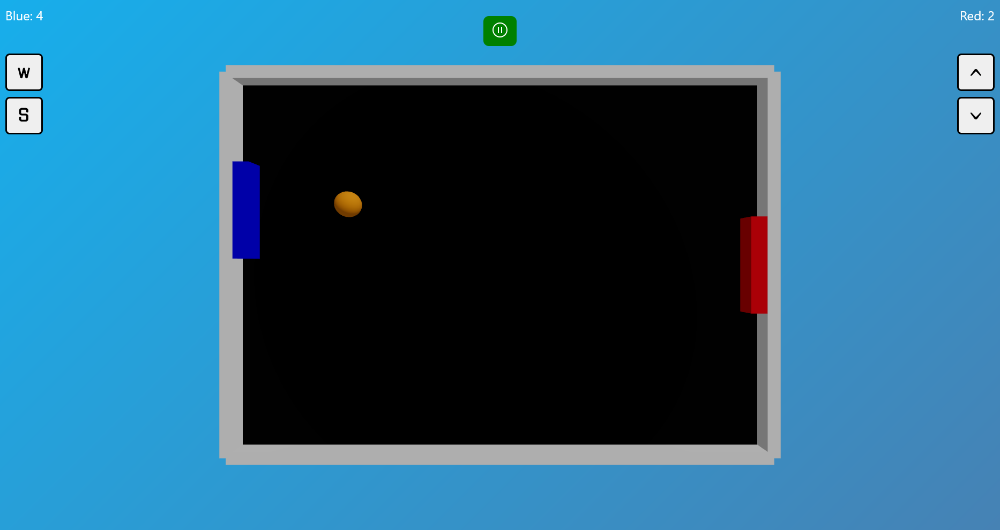
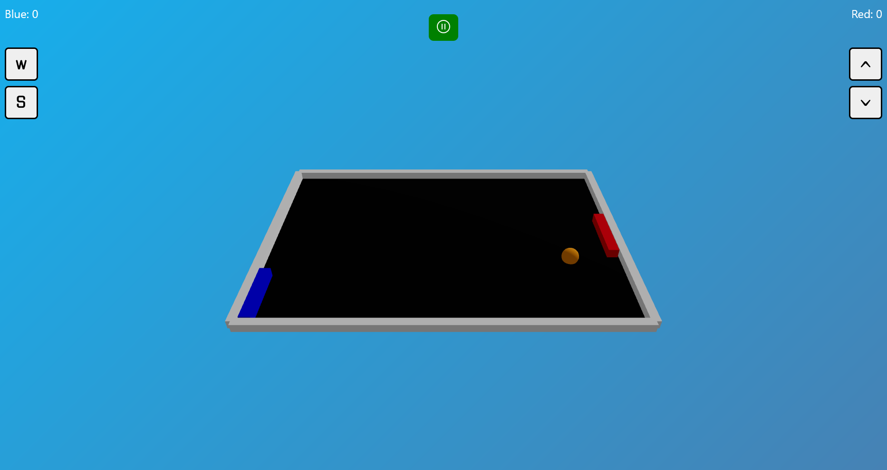

# Pong Game 🏓

Pong Game is a modern `web-based` version of the classic table tennis game, where `two players` compete to hit the ball with their paddles. This game is designed with a sleek 3D look using the latest technologies, providing an interactive and engaging playing experience.

**[Play Now!](https://pong-game-dewa.vercel.app/)**

## Techstack

- **React Three Fiber**: A React renderer for Three.js, enabling the creation of 3D objects in web applications with ease and efficiency.
- **Three.js**: A JavaScript library used to create and display 3D graphics in a web browser.

## Preview

## License

The code is licensed [MIT](LICENSE)
